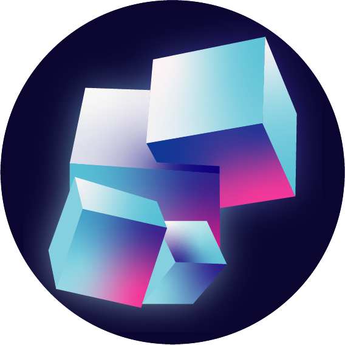
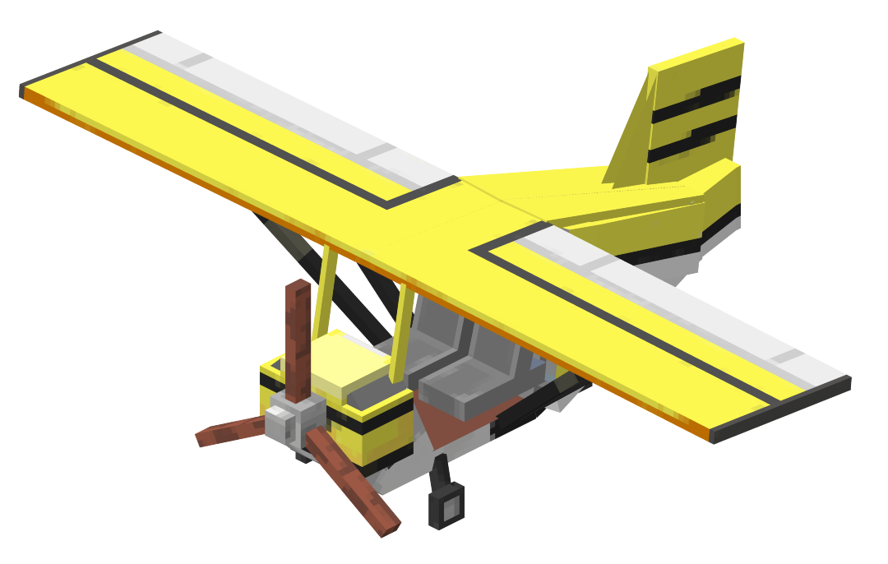

	
	

# EidoVehicules

Ce projet est une extension d’**EidoMod** visant à ajouter des avions et autres véhicules contrôlés uniquement par la caméra du joueur.
Ce mod a été conçu pour un défi, donc vous êtes plus que bienvenu pour y contribuer !

## Contribution

1. Créez une branche dédiée pour chaque nouvelle fonctionnalité ou correction de bug.
2. Commitez vos modifications avec des messages clairs et détaillés.
3. Assurez-vous de respecter la [syntaxe Git](doc/gitSyntax.md) du projet.
4. Soumettez une pull request pour relecture par un autre membre de l’équipe.

### Notes de développement

- Le mod utilise **DeferredRegister** pour enregistrer les items, blocs, entités et couches de modèles.
- Les raccourcis clavier sont enregistrés dynamiquement pour l’interaction utilisateur.
- Des rendus personnalisés et des effets de particules sont implémentés pour des visuels immersifs.

## Auteurs
- Samuel Chapuis aka. Thorid4n

## Licence
Ce projet est **privé**. Toute reproduction, distribution ou utilisation non autorisée est strictement interdite.
