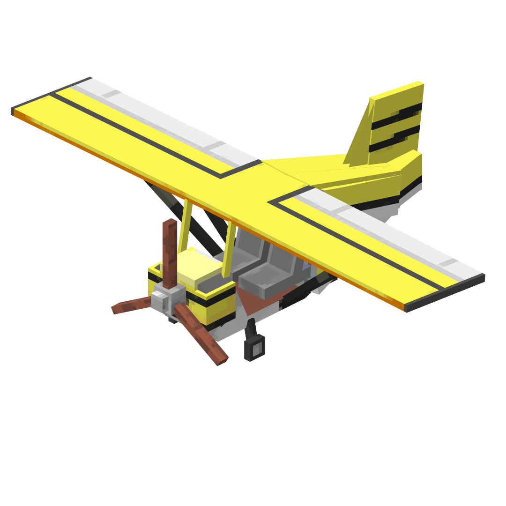

# ForPlanes Mod

Welcome to the **ForPlanes Mod**! This Minecraft Forge mod introduces planes only controlled by the player camera.
This mod was designed for a challenge so you are more than welcome to contribute to it!

## Installation

### Requirements

- **Minecraft Version**: 1.20.1
- **Forge Version**: Compatible with Forge 1.20.1

### Steps

1. Download and install Minecraft Forge for version 1.20.1 from the [modrinth](https://modrinth.com/mod/4plane).
2. Place the `ForPlanes Mod` `.jar` file in your `mods` folder (found in your Minecraft directory).
3. Launch Minecraft with the Forge profile and enjoy the mod!

## Contributing

We welcome contributions to the **ForPlanes Mod**! Whether you want to report bugs, suggest features, or contribute code, please follow these steps:

1. Fork the repository.
2. Create a branch for your feature or bugfix.
3. Commit your changes with detailed descriptions.
4. Make sure you're following the project's [Git syntax](readme/gitSyntax.md).
5. Submit a pull request for review.

### Development Notes

- The mod uses **DeferredRegister** for registering items, blocks, entities, and model layers.
- Key bindings are registered dynamically for user interaction.
- Custom rendering and particle effects are implemented for immersive visuals.

## Project Structure

- `src/main/java/fr/thoridan/planes`: Main Java codebase for the mod.
- `src/main/resources`: Resource files including textures, models, and localization.
- `Readme`: Contains assets for the README file, such as images and logos.

## Licensing

This project is licensed under the **MIT License**. Feel free to use, modify, and distribute the mod as long as proper credit is given.

## Contact

For any questions, feedback, or support, feel free to reach out via the repository's issue tracker or directly at [samuel.chapuis@hotmail.com].

## Credits
- **Creator:** [Samuel Chapuis]
---

Enjoy flying high with the **ForPlanes Mod**! 🚀✈️
 
